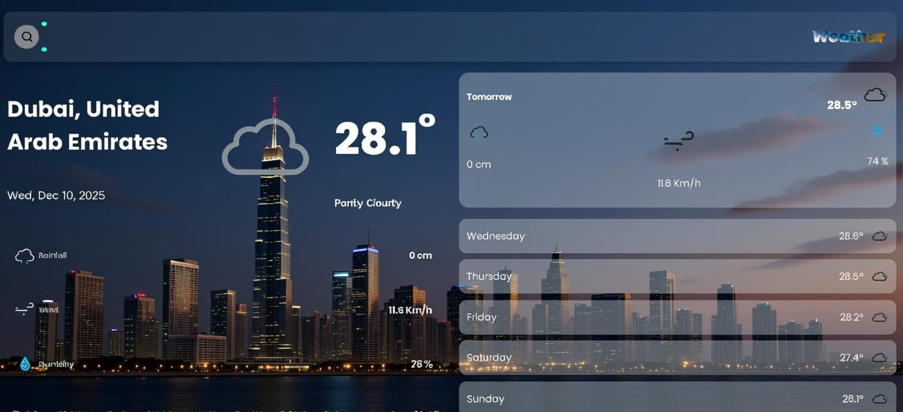

# 🌤️ **WeatherSphere – Modern Real-Time Weather App**

A fast, elegant, and fully responsive weather application built with **HTML, CSS, JavaScript**, and powered by the **Open-Meteo API**. The app provides **real-time weather data**, **24-hour hourly forecast**, **7-day forecast**, dynamic icons, animations, and a modern UI.

---

  

## 🚀 **Live Demo**

🔗 *[https://sachinyedav.github.io/WeatherSphere/](https://sachinyedav.github.io/WeatherSphere/)*

---

## 📸 **Preview**



---

## ✨ **Features**

### 🔥 Core Features

* Live real-time weather data
* Current temperature, humidity, rainfall, wind speed
* 24-hour dynamic hourly cards
* Tomorrow's weather card with auto-updated icons
* 7-day forecast grid
* Dynamic SVG weather icons
* Background/theme change based on weather
* Search by city
* Loading spinner for clean UX

---

## 🎨 **UI / Design Features**

* Modern glassmorphism layout
* Smooth fade-in animations
* Fully mobile responsive
* Clean Poppins typography
* Pixel-perfect card layouts

---

## 🛠️ **Tech Stack**

| Layer          | Technology                           |
| -------------- | ------------------------------------ |
| **Frontend**   | HTML5, CSS3, JavaScript (ES Modules) |
| **API**        | Open-Meteo Weather API               |
| **Icons**      | Custom SVG Weather Icons             |
| **Fonts**      | Google Fonts (Poppins)               |
| **Build**      | Pure optimized vanilla JS            |
| **Deployment** | GitHub Pages                         |

---

## 📂 **Project Structure**

```
/css
  ├── theme.css
  ├── components.css
  ├── animations.css
  ├── responsive.css
  └── style.css

/js
  ├── app.js
  ├── api.js
  ├── ui.js
  └── helper.js

/images
  ├── weather icons (svg)
  ├── preview images
  └── favicon.png

index.html
```

---

## 🔧 **Setup & Installation**

```
git clone https://github.com/SachinYedav/WeatherSphere.git
cd WeatherSphere
open index.html
```

No build tools required — this is a pure static website.

---

## 🌐 **API Information**

### **Open-Meteo Weather API**

* Free
* No API key needed
* Fast response
* Supports hourly & daily forecasts

Example endpoint:

```
https://api.open-meteo.com/v1/forecast?latitude=...&longitude=...&daily=weathercode,...
```

---

## 🧪 **Key JS Modules**

### ✔ `api.js`

Handles API requests.

### ✔ `ui.js`

Renders all DOM elements.

### ✔ `helper.js`

Icon mapping, formatting utilities.

### ✔ `app.js`

Main logic: search, updates, events, loading.

---

## 🏗️ **Performance Optimizations**

* Lazy-loaded SVG icons
* Optimized DOM updates
* Clean semantic HTML

---

## ✨ **Future Enhancements**

* Dark mode
* Geolocation auto-detect
* Weather alerts
* Radar map
* Theme changer

---

## 🤝 **Contributing**

Pull requests are welcome! Improve UI, icons, or features.

---

## 📜 **License**

MIT License

Copyright (c) 2025 **Sachin Yadav**

Permission is hereby granted, free of charge, to any person obtaining a copy
of this software and associated documentation files (the "Software"), to deal
in the Software without restriction, including without limitation the rights
to use, copy, modify, merge, publish, distribute, sublicense, and/or sell
copies of the Software, and to permit persons to whom the Software is
furnished to do so, subject to the following conditions:

The above copyright notice and this permission notice shall be included in all
copies or substantial portions of the Software.

THE SOFTWARE IS PROVIDED "AS IS", WITHOUT WARRANTY OF ANY KIND, EXPRESS OR
IMPLIED, INCLUDING BUT NOT LIMITED TO THE WARRANTIES OF MERCHANTABILITY,
FITNESS FOR A PARTICULAR PURPOSE AND NONINFRINGEMENT. IN NO EVENT SHALL THE
AUTHORS OR COPYRIGHT HOLDERS BE LIABLE FOR ANY CLAIM, DAMAGES OR OTHER
LIABILITY, WHETHER IN AN ACTION OF CONTRACT, TORT OR OTHERWISE, ARISING FROM,
OUT OF OR IN CONNECTION WITH THE SOFTWARE OR THE USE OR OTHER DEALINGS IN THE
SOFTWARE.

---

## 👨‍💻 **Author**

**Sachin Yadav**
GitHub: [https://github.com/SachinYedav](https://github.com/SachinYedav)
